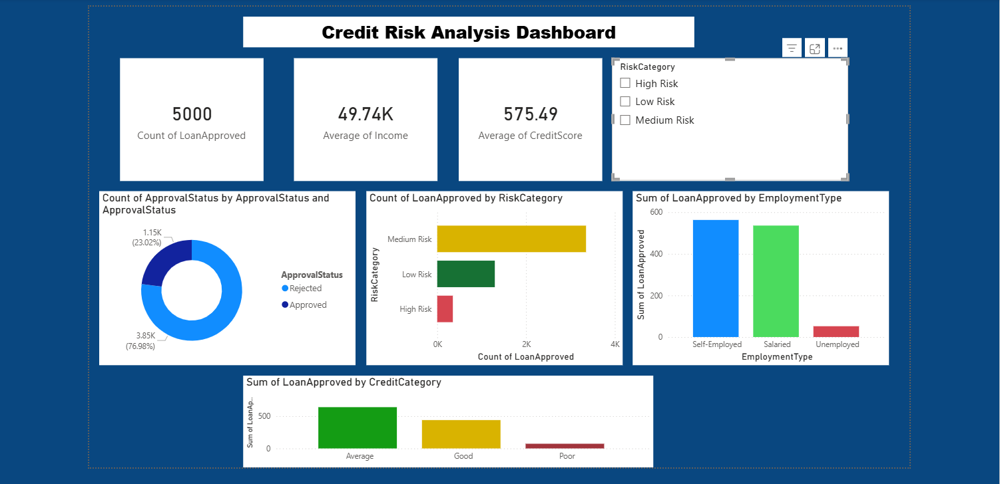

# 💳 Credit Risk Analysis Dashboard

## 📌 Project Overview
Analysis of 5,000 loan applicants using Python and Power BI
to identify credit risk patterns and loan approval factors.

## 🛠️ Tools Used
- Python (Pandas, Seaborn, Matplotlib)
- Power BI Desktop
- Dataset: Loan Risk Prediction Dataset

## 📊 Key Insights
- Overall approval rate: 23.8%
- Unemployed applicants: only 3.1% approval
- Salaried applicants: 34.4% approval
- High Risk applicants: 2% approval
- Low Risk applicants: 47.5% approval

## 📁 Files
| File | Description |
|------|-------------|
| `credit_loan_analysis_project.py` | Python EDA code |
| `loan_risk_prediction_dataset.csv` | Raw dataset |
| `Loan data analysis.pbix` | Power BI file |

## 🔍 Features
- Data cleaning and preprocessing
- Exploratory Data Analysis (EDA)
- Risk categorization (High/Medium/Low)
- Income grouping
- Credit score categorization
- Interactive Power BI dashboard

## 📸 Dashboard Preview

## 👩‍💻 Author
Swetha — B.Tech CSE, SR University
